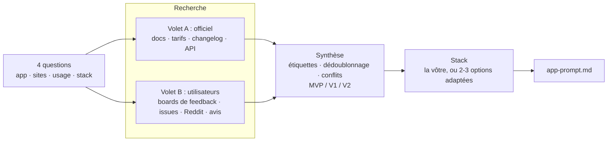

# reverse-app-prompt 🔬 — Une app en entrée, un prompt prêt à construire en sortie

<p align="center"><a href="README.md">English</a> · <b>Français</b></p>

<p align="center">
  <picture>
    <source media="(prefers-color-scheme: light)" srcset="docs/assets/banner-light.svg">
    
  </picture>
</p>

<p align="center">
  <a href="LICENSE"></a>
  <a href="https://agentskills.io"></a>
  <a href="#installation"></a>
  <a href="https://github.com/librehubstore/skill-reverse-app/stargazers"></a>
  <a href="https://github.com/librehubstore/skill-reverse-app/commits/main"></a>
</p>

**reverse-app-prompt** est un skill d'agent open-source qui fait la rétro-ingénierie des fonctionnalités d'une application existante à partir de tout ce qui est public sur le web : documentation, tarifs, changelog et API, mais aussi rapports de bugs, demandes d'amélioration, forums et avis des stores. Il en tire un **prompt fonctionnel complet** à donner à Claude Code, ou à n'importe quel agent de code, pour construire votre propre application, équivalente ou meilleure.

**Pas un clone, une meilleure version.** Les fonctionnalités documentées de l'original servent de base. Les demandes les plus votées de ses utilisateurs et ses bugs récurrents deviennent votre feuille de route. Chaque fonctionnalité renvoie à sa source, et la nouvelle application a son propre nom : ni marque, ni logo, ni texte de l'original n'est repris.

[Installation](#installation) · [Démarrage rapide](#démarrage-rapide) · [Fonctionnement](#fonctionnement) · [Ce que vous obtenez](#ce-que-vous-obtenez) · [Modes](#modes) · [FAQ](#faq) · [Licence](LICENSE)

> Le skill vous parle et écrit le prompt **dans votre langue** : demandez en français, vous obtenez un prompt en français.

## Installation

Le plus rapide : une seule commande, pour tous les agents pris en charge.

```bash
npx skills add librehubstore/skill-reverse-app
```

<details>
<summary><b>Claude Code : marketplace de plugins</b></summary>

```
/plugin marketplace add librehubstore/skill-reverse-app
/plugin install reverse-app-prompt@reverse-app-prompt
```

Les mises à jour se récupèrent avec `/plugin marketplace update`.
</details>

<details>
<summary><b>GitHub CLI</b></summary>

```bash
gh skill install librehubstore/skill-reverse-app reverse-app-prompt --agent claude-code --scope user
# --agent : claude-code, github-copilot, cursor, codex, gemini-cli, opencode…
```
</details>

<details>
<summary><b>Installation manuelle (tous agents)</b></summary>

Copiez `skills/reverse-app-prompt` dans le dossier de skills de votre agent :

| Agent | Utilisateur (tous projets) | Projet uniquement |
|---|---|---|
| Claude Code | `~/.claude/skills/` | `.claude/skills/` |
| OpenAI Codex | `~/.agents/skills/` | `.agents/skills/` |
| GitHub Copilot (VS Code, CLI) | `~/.copilot/skills/` | `.github/skills/` |
| Cursor | `~/.cursor/skills/` | `.cursor/skills/` |
| Gemini CLI | `~/.gemini/skills/` | `.gemini/skills/` |
| Autre agent compatible `SKILL.md` | `~/.agents/skills/` | `.agents/skills/` |

```bash
# macOS / Linux / Git Bash
git clone https://github.com/librehubstore/skill-reverse-app.git
mkdir -p ~/.claude/skills && cp -r skill-reverse-app/skills/reverse-app-prompt ~/.claude/skills/
```

```powershell
# Windows PowerShell
git clone https://github.com/librehubstore/skill-reverse-app.git
New-Item -ItemType Directory -Force "$HOME\.claude\skills" | Out-Null
Copy-Item -Recurse skill-reverse-app\skills\reverse-app-prompt "$HOME\.claude\skills\"
```

Redémarrez ensuite l'agent pour qu'il découvre le skill.
</details>

<details>
<summary><b>Claude.ai et Claude Desktop</b></summary>

1. Compressez le dossier `skills/reverse-app-prompt` en `reverse-app-prompt.zip`, le dossier lui-même à la racine du ZIP.
2. Ouvrez **Settings → Capabilities → Skills**, cliquez sur **Upload skill** et choisissez le ZIP.
3. Activez la recherche web, ainsi que Claude in Chrome si vous l'avez.
</details>

**Prérequis :** l'agent doit pouvoir chercher sur le web et lire des pages. Un navigateur piloté (Claude in Chrome, Playwright MCP…) est recommandé pour les sites chargés en JavaScript ou protégés contre les robots, comme G2 ou les avis des stores.

## Démarrage rapide

Demandez simplement, le skill se déclenche tout seul :

```
> Je veux créer une alternative interne à KanbanFlow, propose-moi une stack.
```

Il pose 4 questions : l'application, ses sites officiels (« je ne sais pas » convient), l'usage public ou interne, et la stack cible. Il fait ensuite 10 à 20 minutes de recherche, puis écrit :

```
kanbanflow-prompt.md          ← le prompt à donner à Claude Code
kanbanflow-research/notes.md  ← chaque fonctionnalité avec l'URL de sa source
```

Ouvrez une nouvelle session dans un dossier vide et donnez-lui le prompt :

```
> Lis kanbanflow-prompt.md et construis l'application.
```

## Fonctionnement



- **Recherche web et lecture de pages d'abord** : rapide, rien à installer. Le navigateur ne sert qu'en secours, pour les pages chargées en JavaScript, les blocages anti-robots (403) ou les grilles tarifaires qui paraissent identiques une fois réduites en texte.
- **Les retours viennent d'au moins trois types de sources**, jamais des seuls sites d'avis : les boards de feedback et Reddit montrent ce que les utilisateurs demandent vraiment, et à quelle fréquence.
- **Chaque information garde l'URL de sa source** dans les notes de recherche, pour que rien ne se perde entre la recherche et la rédaction.
- **Les contradictions sont signalées, pas cachées** : la source officielle la plus récente l'emporte, et chaque conflit est listé dans les « Questions ouvertes ».

## Ce que vous obtenez

Un seul prompt Markdown, écrit pour être suivi sans autre contexte :

| Section | Contenu |
|---|---|
| Instructions pour l'agent | Planifier par phases, construire le MVP de bout en bout, tester les critères d'acceptation |
| Contexte | App de référence, nom de code, usage, éléments différenciants |
| Rôles et permissions | Qui peut faire quoi |
| Périmètre | Chaque fonctionnalité × priorité × étiquette d'origine |
| Modules fonctionnels | User stories, règles de gestion, critères d'acceptation testables |
| Parcours clés | Onboarding (ou premier lancement), flux principaux |
| Modèle de données | Entités, champs, relations, diagramme Mermaid |
| Offres et limites | Quotas, plus la liste des « Questions ouvertes » |
| Intégrations et API | Import/export, API publique, webhooks |
| Non fonctionnel | Sécurité, accessibilité, i18n, hors-ligne, performance |
| Défauts à éviter | Les bugs récurrents de l'original et le comportement attendu |
| Hors périmètre · Stack · Sources | Exclusions explicites, stack retenue, toutes les URL consultées |

Chaque fonctionnalité porte son origine, pour distinguer ce qui est fidèle de ce qui est amélioré. Les étiquettes restent en anglais, quelle que soit la langue du prompt :

| Étiquette | Signification |
|---|---|
| `[Official]` | Documentée par l'éditeur |
| `[Inferred]` | Déduite (de l'API, de captures…), à confirmer |
| `[Requested]` | Demandée par les utilisateurs, avec sa popularité quand elle est connue |
| `[Fix]` | Bug connu de l'original, corrigé dès la conception |

## Modes

**Public**, par défaut : un produit ouvert à tous, comme l'original, avec inscription, onboarding et offres quand c'est pertinent.

**Interne** : un outil pour votre propre équipe. L'inscription, l'onboarding, les invitations par email, le SSO, la double authentification, la facturation et les pages marketing sont retirés. On se connecte par identifiant et mot de passe, les comptes sont créés par un admin, et le premier admin est créé au premier lancement. Toutes les fonctionnalités, y compris les payantes de l'original, sont ouvertes à tous, et tout ce qui est retiré est listé dans « Hors périmètre ».

**Stack** : imposez la vôtre (« NestJS + Angular + PostgreSQL ») ou laissez le skill proposer 2 ou 3 options adaptées à ce que la recherche a révélé (temps réel, mobile, hors-ligne, outil interne…), à partir de son [catalogue de stacks](skills/reverse-app-prompt/references/stacks.md).

## FAQ

<details>
<summary><b>Est-ce légal ?</b></summary>

Le skill ne lit que des informations publiques et reconstruit des **fonctionnalités**, qui ne sont en général pas protégées. Il ne copie jamais de code, de textes, de visuels ni de marques, et la nouvelle application a son propre nom. Vérifiez tout de même les conditions d'utilisation des sites consultés et le droit applicable (propriété intellectuelle, marques) avant de commercialiser un produit dérivé.
</details>

<details>
<summary><b>Et si l'application n'a pas de centre d'aide public ?</b></summary>

Le skill se rabat sur la documentation de l'API, la FAQ des pages tarifs, les fiches des stores, les tutoriels tiers et les anciennes pages d'aide archivées sur web.archive.org. Le prompt indique alors quelles règles ont été déduites.
</details>

<details>
<summary><b>Combien coûte une analyse ?</b></summary>

Dans nos tests sur KanbanFlow, une recherche complète a lu environ 50 pages en 6 à 12 minutes, pour 110 000 à 160 000 tokens.
</details>

<details>
<summary><b>Puis-je utiliser le prompt avec autre chose que Claude Code ?</b></summary>

Oui. Le prompt est du Markdown simple et autonome, que n'importe quel agent de code peut suivre.
</details>

## Organisation du dépôt

```
skills/reverse-app-prompt/
├── SKILL.md                     # démarche complète
└── references/
    ├── prompt-template.md       # modèle du prompt final
    └── stacks.md                # catalogue de stacks par profil d'application
.claude-plugin/marketplace.json  # marketplace Claude Code
evals/evals.json                 # cas de test du skill
docs/assets/                     # bannière
```

## Contribuer

Les issues et pull requests sont les bienvenues. Les contributions les plus utiles :
- une analyse d'un nouveau type d'application (open-source, mobile, desktop) où le skill a raté quelque chose ;
- de nouvelles sources de retours utilisateurs ;
- des entrées pour le catalogue de stacks.

Indiquez l'application testée et ce qui n'a pas marché. Les contributions au skill se font en anglais.

## Contributeurs

<a href="https://github.com/librehubstore/skill-reverse-app/graphs/contributors">
  
</a>

## Licence

[MIT](LICENSE) © 2026 Hervé Combey
