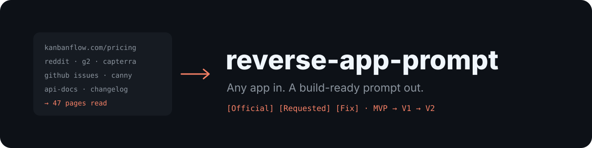
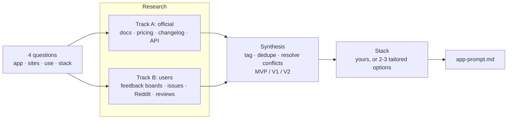

# reverse-app-prompt 🔬 — Any app in, a build-ready prompt out

<p align="center">
  <picture>
    <source media="(prefers-color-scheme: light)" srcset="docs/assets/banner-light.svg">
    
  </picture>
</p>

<p align="center">
  <a href="LICENSE"></a>
  <a href="https://agentskills.io"></a>
  <a href="#install"></a>
  <a href="https://github.com/librehubstore/skill-reverse-app/stargazers"></a>
  <a href="https://github.com/librehubstore/skill-reverse-app/commits/main"></a>
</p>

**reverse-app-prompt** is an open-source agent skill that reverse-engineers the features of an existing application from everything publicly available on the web: docs, pricing, changelog and API, but also bug reports, feature requests, forums and store reviews. It turns all of it into one **complete functional prompt** you hand to Claude Code, or any coding agent, to build your own equivalent or better app.

**Not a clone, a better version.** The original's documented features set the baseline. Its users' most-voted requests and recurring bugs become your roadmap. Every feature is traced back to its source, and the new app gets its own name: no brand, logo or copy is reused.

[Install](#install) · [Quick start](#quick-start) · [How it works](#how-it-works) · [What you get](#what-you-get) · [Modes](#modes) · [FAQ](#faq) · [License](LICENSE)

> The skill talks to you and writes the prompt in **French** by default. Ask for another language and it will follow.

## Install

The fastest way is one command, for any supported agent:

```bash
npx skills add librehubstore/skill-reverse-app
```

<details>
<summary><b>Claude Code: plugin marketplace</b></summary>

```
/plugin marketplace add librehubstore/skill-reverse-app
/plugin install reverse-app-prompt@reverse-app-prompt
```

Get updates with `/plugin marketplace update`.
</details>

<details>
<summary><b>GitHub CLI</b></summary>

```bash
gh skill install librehubstore/skill-reverse-app reverse-app-prompt --agent claude-code --scope user
# --agent: claude-code, github-copilot, cursor, codex, gemini-cli, opencode…
```
</details>

<details>
<summary><b>Manual install (any agent)</b></summary>

Copy `skills/reverse-app-prompt` into your agent's skills directory:

| Agent | User (all projects) | Project only |
|---|---|---|
| Claude Code | `~/.claude/skills/` | `.claude/skills/` |
| OpenAI Codex | `~/.agents/skills/` | `.agents/skills/` |
| GitHub Copilot (VS Code, CLI) | `~/.copilot/skills/` | `.github/skills/` |
| Cursor | `~/.cursor/skills/` | `.cursor/skills/` |
| Gemini CLI | `~/.gemini/skills/` | `.gemini/skills/` |
| Other `SKILL.md`-compatible agent | `~/.agents/skills/` | `.agents/skills/` |

```bash
# macOS / Linux / Git Bash
git clone https://github.com/librehubstore/skill-reverse-app.git
mkdir -p ~/.claude/skills && cp -r skill-reverse-app/skills/reverse-app-prompt ~/.claude/skills/
```

```powershell
# Windows PowerShell
git clone https://github.com/librehubstore/skill-reverse-app.git
New-Item -ItemType Directory -Force "$HOME\.claude\skills" | Out-Null
Copy-Item -Recurse skill-reverse-app\skills\reverse-app-prompt "$HOME\.claude\skills\"
```

Restart the agent so it picks up the skill.
</details>

<details>
<summary><b>Claude.ai and Claude Desktop</b></summary>

1. Zip the `skills/reverse-app-prompt` folder as `reverse-app-prompt.zip`, with the folder itself at the root of the ZIP.
2. Open **Settings → Capabilities → Skills**, click **Upload skill** and pick the ZIP.
3. Enable web search, and Claude in Chrome if you have it.
</details>

**Requirements:** the agent must be able to search the web and read pages. A controllable browser (Claude in Chrome, Playwright MCP…) is recommended for JavaScript-heavy or bot-protected sites such as G2 or app store reviews.

## Quick start

Just ask, the skill triggers on its own:

```
> I want to build an internal alternative to KanbanFlow, suggest a stack.
```

It asks 4 questions: the app, its official sites ("I don't know" is fine), public or internal use, and the target stack. Then it researches for 10 to 20 minutes and writes:

```
kanbanflow-prompt.md          ← the prompt to hand to Claude Code
kanbanflow-research/notes.md  ← every feature with its source URL
```

Open a fresh session in an empty folder and feed it the prompt:

```
> Read kanbanflow-prompt.md and build it.
```

## How it works



- **Web search + page reading first**: fast, nothing to install. The browser is only a fallback, for pages rendered in JavaScript, 403/anti-bot walls, or pricing grids that look identical once flattened to text.
- **Feedback from at least three kinds of sources**, never review sites alone: feedback boards and Reddit show what users actually ask for, and how often.
- **Every claim keeps its source URL** in the research notes, so nothing gets lost between research and writing.
- **Conflicts are surfaced, not hidden**: the most recent official source wins, and every conflict is listed under "Points à valider".

## What you get

A single Markdown prompt, written to be followed on its own:

| Section | Content |
|---|---|
| Instructions for the agent | Plan by phases, build the MVP end to end, test the acceptance criteria |
| Context | Reference app, code name, use, differentiators |
| Roles & permissions | Who can do what |
| Scope | Every feature × priority × origin tag |
| Functional modules | User stories, business rules, testable acceptance criteria |
| Key user journeys | Onboarding (or first launch), main flows |
| Data model | Entities, fields, relations, Mermaid ER diagram |
| Plans & limits | Quotas, plus the "Points à valider" list |
| Integrations & API | Import/export, public API, webhooks |
| Non-functional | Security, accessibility, i18n, offline, performance |
| Pain points to avoid | The original's recurring bugs and the expected behavior |
| Out of scope · Stack · Sources | Explicit exclusions, chosen stack, every URL consulted |

Each feature carries its origin, so you know what is faithful and what is improved:

| Tag | Meaning |
|---|---|
| `[Officiel]` | Documented by the vendor |
| `[Déduit]` | Inferred (from the API, screenshots…), to confirm |
| `[Demande]` | Feature request from users, with popularity when known |
| `[Correctif]` | Known bug of the original, fixed by design |

## Modes

**Public**, the default: a product open to anyone, like the original, with sign-up, onboarding and plans when relevant.

**Internal**: a tool for your own team. Sign-up, onboarding, email invitations, SSO, 2FA, billing and marketing pages are removed. Login is username and password, accounts are created by an admin, and the first admin is seeded at first launch. Every feature, including the original's paid ones, is available to everyone, and everything removed is listed under "Out of scope".

**Stack**: impose your own ("NestJS + Angular + PostgreSQL") or let the skill suggest 2-3 options matched to what the research revealed (real-time, mobile, offline, CRUD-heavy internal tool…), from its [stack catalog](skills/reverse-app-prompt/references/stacks.md).

## FAQ

<details>
<summary><b>Is this legal?</b></summary>

The skill only reads public information and rebuilds **features**, which are generally not protected. It never copies code, copy, visuals or trademarks, and the new app gets its own name. Still, check the terms of use of the sites it reads and your local law (IP, trademarks) before commercializing a derived product.
</details>

<details>
<summary><b>What if the app has no public help center?</b></summary>

It falls back on the API docs, the FAQ on the pricing pages, store listings, third-party tutorials and archived help pages on web.archive.org. The prompt then flags which rules were inferred.
</details>

<details>
<summary><b>How much does a run cost?</b></summary>

In our tests on KanbanFlow, a full research run read about 50 pages in 6 to 12 minutes, for 110k to 160k tokens.
</details>

<details>
<summary><b>Can I use the prompt with something other than Claude Code?</b></summary>

Yes. The prompt is plain, self-contained Markdown, and any coding agent can follow it.
</details>

## Repository layout

```
skills/reverse-app-prompt/
├── SKILL.md                     # full workflow
└── references/
    ├── prompt-template.md       # final prompt template
    └── stacks.md                # tech stack catalog by application profile
.claude-plugin/marketplace.json  # Claude Code marketplace
evals/evals.json                 # skill test cases
docs/assets/                     # banner
```

## Contributing

Issues and pull requests are welcome. The most useful contributions are:
- a run on a new kind of app (open-source, mobile, desktop) where the skill missed something;
- new sources of user feedback;
- entries for the stack catalog.

Please include the app you tested and what went wrong.

## Contributors

<a href="https://github.com/librehubstore/skill-reverse-app/graphs/contributors">
  
</a>

## License

[MIT](LICENSE) © 2026 Hervé Combey
